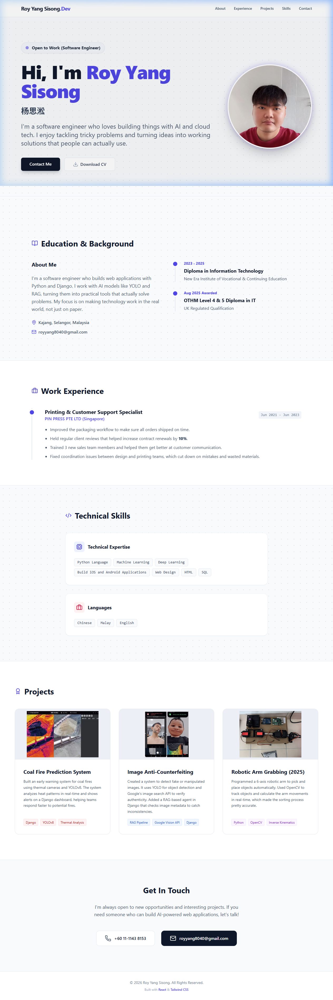

# Roy Yang Sisong - Personal Portfolio Website



> 🌐 **Live Demo**: [https://royyang.netlify.app](https://royyang.netlify.app)

> 📁 **GitHub Repo**: [https://github.com/BANANAROCKET12345/roy-portfolio](https://github.com/BANANAROCKET12345/roy-portfolio)

> **[English Version](#english)** | **[中文版本](#chinese)**

---

<a id="english"></a>
## 🇬🇧 English Version

### 📌 Project Overview
This is my personal portfolio website built with React.
It showcases my resume, AI projects, work experience, and education background. I use it for job applications and to show what I can build.

**Tech Stack:**
- **React** (Vite)
- **Tailwind CSS** (Styling & Responsive Design)
- **Lucide React** (Icons)

**Design Style:**
- **Theme**: Indigo + Slate (Clean and professional).
- **Visuals**: Dot Grid Background + Monospace Fonts (Tech-focused look).
- **Content**: 
    - Natural, human-written copy.
    - **Skills section aligned 100% with resume PDF.**

---

### 🚀 How to Start

1. **Install Dependencies**
   ```bash
   npm install
   ```

2. **Start Dev Server**
   ```bash
   npm run dev
   ```
   Access via browser: `http://localhost:5173`

3. **Build for Production**
   ```bash
   npm run build
   ```
   Output directory: `dist` folder.

4. **Deploy to Netlify**
   - Drag and drop the `dist` folder to [Netlify](https://app.netlify.com/)
   - Or use Netlify CLI: `netlify deploy --prod --dir=dist`

---

### 📂 Project Structure

```
src/
├── components/      # UI Components (Hero, About, Projects, etc.)
├── data/            # Data Center (Single source of truth for content)
│   └── index.js
├── pages/           # Page Views (Home, NotFound)
├── App.jsx          # Router Config
└── index.css        # Global Styles
```

---

### ✅ Completed Features
- [x] **Core Pages**: Hero, About, Education, Experience, Projects, Contact.
- [x] **Responsive**: Full Mobile & Desktop support.
- [x] **Router**: React Router implemented (Home + 404 Page).
- [x] **Clean Code Structure**:
    - [x] **Componentization**: Split into reusable components.
    - [x] **Data Separation**: Content extracted to `src/data/index.js`.
- [x] **Real Content**:
    - [x] **Projects**: Real screenshots implemented (Coal Fire, Anti-Counterfeiting, Robotic Arm).
    - [x] **Skills**: Refactored to vertical layout & synchronized with resume text.
- [x] **UX Enhancements**: Scroll-to-Top button, Custom Favicon ("R"), Hover effects.
- [x] **Preview Screenshot**: `preview.png` added for GitHub README display.

---

### 📝 How to Edit Content
**Want to update your resume or projects?**
No complex coding required! Just open `src/data/index.js`:
- Edit `personalInfo` for profile details.
- Edit `projectsData` for project list.
- Edit `skillsData` for tech stack.

---

<br>
<br>
<br>

---

<a id="chinese"></a>
## 🇨🇳 中文版本


> 🌐 **在线演示**: [https://royyang.netlify.app](https://royyang.netlify.app)

> 📁 **GitHub 仓库**: [https://github.com/BANANAROCKET12345/roy-portfolio](https://github.com/BANANAROCKET12345/roy-portfolio)

### 📌 项目简介
这是我用 React 做的个人作品集网站。
主要展示我的简历、AI 项目、工作经验和教育背景，用来找工作和展示我会做什么。

**技术栈：**
- **React** (Vite)
- **Tailwind CSS** (样式与响应式设计)
- **Lucide React** (图标库)

**设计风格：**
- **主题色**：Indigo (靛青) + Slate (深灰) - 看起来专业又稳重。
- **视觉元素**：Dot Grid (点阵网格) 背景 + Monospace (等宽) 字体。
- **内容特点**：文案去 AI 化，技能列表与 PDF 简历完全同步。

---

### 🚀 如何启动项目

1. **安装依赖** (如果是在新环境)
   ```bash
   npm install
   ```

2. **启动开发服务器** (预览模式)
   ```bash
   npm run dev
   ```
   启动后，打开浏览器访问：`http://localhost:5173`

3. **打包构建** (准备部署)
   ```bash
   npm run build
   ```
   构建完成后，会生成一个 `dist` 文件夹。

4. **部署到 Netlify**
   - 拖拽 `dist` 文件夹到 [Netlify](https://app.netlify.com/)
   - 或使用 Netlify CLI: `netlify deploy --prod --dir=dist`

---

### 📂 项目结构

```
src/
├── components/      # UI 组件 (Hero, About, Projects, etc.)
├── data/            # 数据中心 (所有简历文字、项目信息都在这里修改)
│   └── index.js
├── pages/           # 页面视图 (Home, NotFound)
├── App.jsx          # 路由配置
└── index.css        # 全局样式
```

---

### ✅ 已完成功能
- [x] **核心页面**：Hero, About, Education, Experience, Projects, Contact 板块。
- [x] **路由系统**：集成了 React Router (主页 + 404 页面)。
- [x] **代码结构优化**：
    - [x] **组件拆分**：代码结构清晰。
    - [x] **数据抽离**：简历内容已提取至 `src/data/index.js`，方便维护。
- [x] **真实内容**：
    - [x] **Projects**: 3个项目均已实装真实截图。
    - [x] **Skills**: 技能列表已改为垂直布局，并与简历原文同步。
- [x] **交互增强**：回到顶部按钮、自定义 Favicon、平滑滚动。
- [x] **预览截图**：已添加 `preview.png`，GitHub README 可直接显示网站预览图。

---

### 📝 如何修改内容
**想修改简历或项目？**
不需要动复杂的代码！只需打开 `src/data/index.js`：
- 修改 `personalInfo` 更新个人资料。
- 修改 `projectsData` 更新项目列表。
- 修改 `skillsData` 更新技能树。

---

© 2026 Roy Yang. All Rights Reserved.
